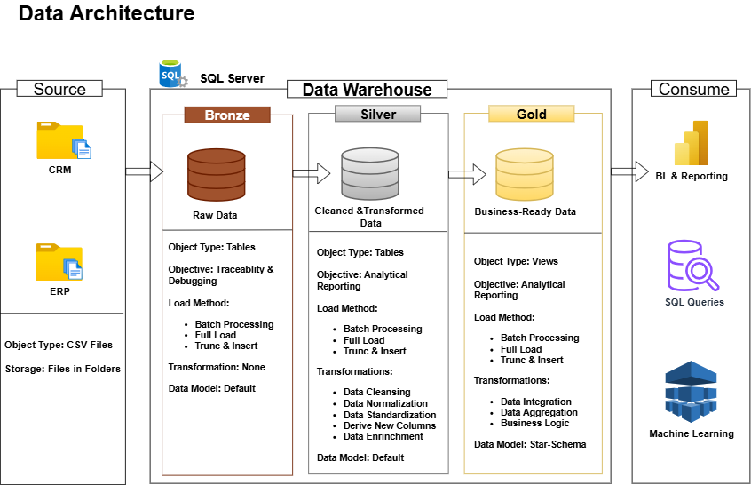

# Data Warehouse and Analytics Project

Welcome to the **Data Warehouse and Analytics Project** repository!
This project demonstrates a comprehensive data warehousing and analytics, from building a data warehouse to generating actionable insights. This portfolio project showcases industry best practices in data engineering and analytics.

---

## Project Overview
This project involves:

1. **Data Architecture**: Designing a modern data warehouse using Medalion Architecture **Bronze**, **Silver**, and **Gold** layers.
2. **ETL Pipelines**: Extracting, transforming, and loading data from source systems into the data warehouse.
3. **ETL Logging & Auditing**: Creating log tables that track and monitor the full etl process, enabling easy tracebability and debugging.
4. **ETL Pipeline Control**: Creating a control table that monitors the execution order of the full etl run.
5. **Data Modeling**: Develping fact and dimension tables optimized for analytical queries.
6. **Analytics & Reporting**: Creating SQL-based reports to support data-driven decisions.

This repository is an excellent resource for professionals, and students looking to showcase expertise in:

* SQL Development
* Data Architect
* Data Engineering
* Building ETL Pipeline
* Data Modeling
* Data Analytics

---

## Project Requirements

### Build a Data Warehouse (Data Engineering)

#### Objective

Create a mordern **data warehouse using SQL server** to consolidate sales data, enabling analytical reporting and informed decision-making.

##### Specifications

* **Data Sources**: Import data from two source systems (CRM and ERP), provided as CSV files.
* **Data Quality**: Cleanse and resolve data quality issue prior to analysis.
* **Integration**: Consolidate both data from data sources into user friendly data, enabling analytical queries.
* **Scope**: Focus on latest data only; no historization allowed.
* **Documentation**: Provide clear documentation of the data model to support business stakeholders and analytical teams.

---

## Tools & Technologies Used
This project was built using the following tools:
* **Notion**: For Project Planning.
* **SQL Server**: Database platform for data storage.
* **SQL Server Management Studio (SSMS)**: For database management and query execution.
* **Draw.io**: For designing the data architecture, data flow, data integration model, and data model.
* **Github**: For project documentation, and committing codes.

---

## 01. Analytics and Reporting (Data Analytics)

### Objectives

Generate an SQL-based analytics that provide detailed insights into:

* **Customer Behaviour**
* **Product Performance**
* **Sales Trends**

These provide key metrics to support strategic decision-making and business growth.

---

## Data Architecture
The data architecture follows the Medalion Architecture **Bronze**, **Silver**, and **Gold** layers:

1. **Bronze Layer**: Stores raw data as-is from the source system, enabling traceability and debugging.
2. **Silver Layer**: Stores cleaned, prepared, and transformed data. It is designed to support analysis.
3. **Gold Layer**: Houses business-ready data modeled into a star schema, supporting reporting and analytics.

---

## License
This project is lincesed under **MIT Lincense**. You are free to use, modify, or share with proper attribution.

---

## About Me
Hi there! I'm **Otusanya Toyib Oluwatimilehin**, a **First-Class Gradute** of Industrial Chemistry from Olabisi Onabanjo University. I'm an aspiring **Data Engineer and Analyst** passionate about building reliable data pipelines, efficient data models, and generating data-driven business decisions. 

 **07060784176** 
 **toyibotusanya@gmail.com**
